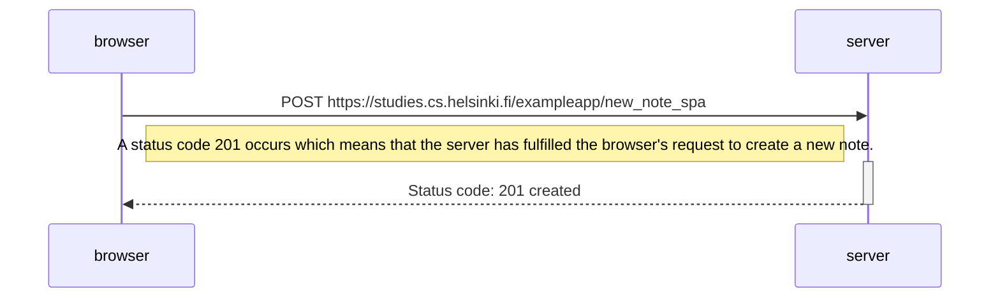

When creating a new note, The first exampleapp (introduced in exercise 0.4) requested new GET requests to reload the page. 
The Single Page App version on the other hand renders updated notes without the need to reload the page.

